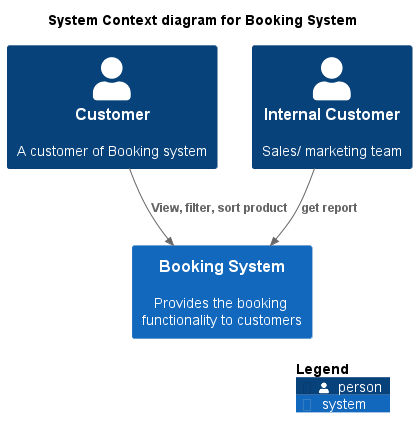
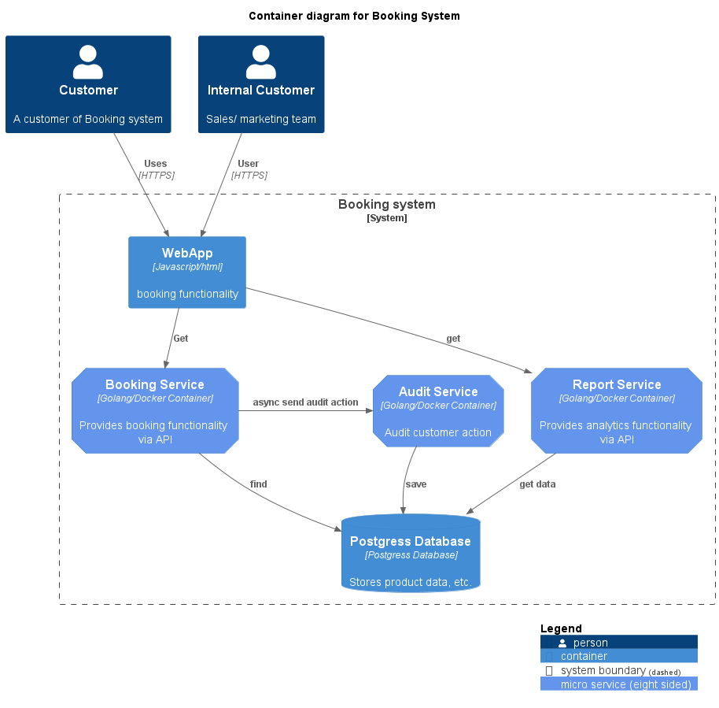
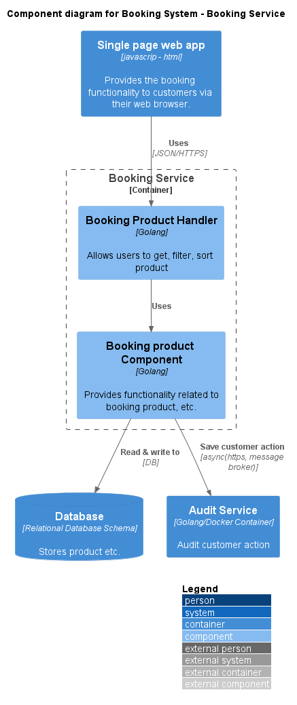
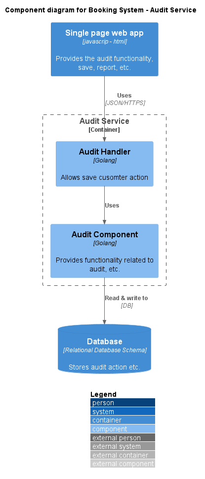
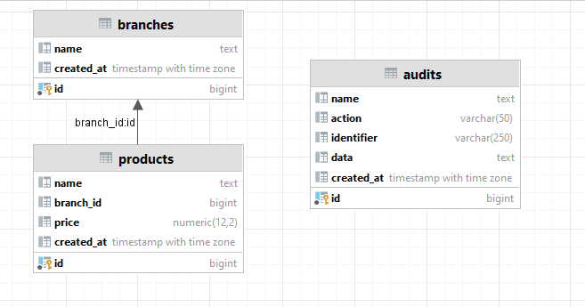
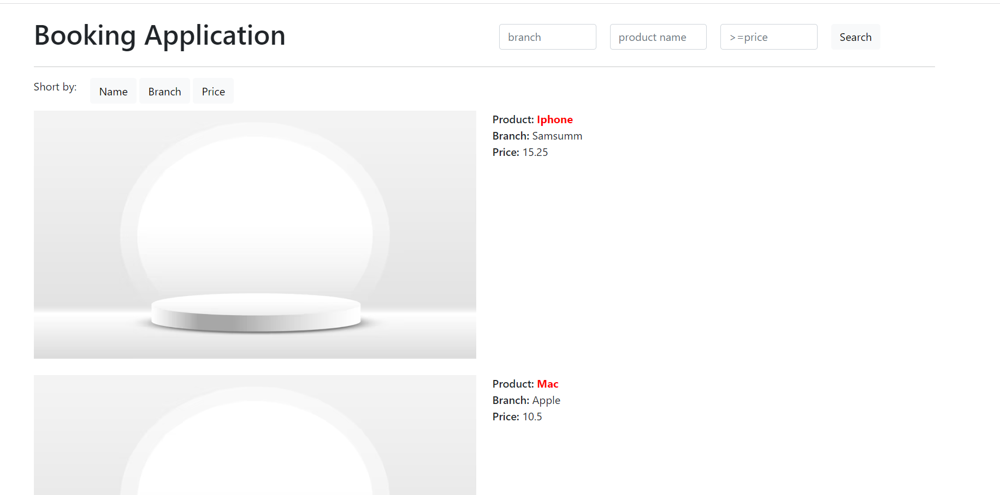

# booking-app
Building an online booking application to sell their
products.


#### Context Diagram
---



#### Container Diagram
---


#### Component Diagram
----




#### Tructure project
---

```
├───audit-service
│   ├───api // handler incoming request
│   ├───config
│   ├───db
│   ├───dto
│   ├───logic
│   ├───storage // maping entity
│   └───utils
├───booking-service
│   ├───api
│   ├───config
│   ├───db
│   │   └───migrations
│   ├───dto
│   ├───logic
│   ├───repo
│   ├───restclient
│   ├───storage
│   └───utils
├───doc
│   ├───image
│   └───planuml
└───webapp
    ├───assets
    ├───css
    └───js

```
#### Database diagram
---


In current solution. I only use single database for 2 service: booking-service and audit-service.
For best practice, We should split to 2 database independenly:
- bookingdb: branchs, product table.
- auditdb: audits.


#### Set up & Installation
---
##### Installation:
- Golang >= 1.20
- PostgresSQL.
- Creata database with name **bookingdb**
- Download all package for **booking service**
     ```
    cd booking-service
    go mod tidy
    ```
- Run migration data, change database server info on your machine.
    ```
    migrate -database postgres://{user}:{pass}@{host}/bookingdb?sslmode=disable -path db/migrations up
- Download all package for **audit service**
     ```
    cd audit-service
    go mod tidy
    ```


##### Running App on LocalHost:
1. **Booking-service**
- Change file booking-service/.env.example to booking-service/.env and change database info for postgres sql:
    ```
    DATABASE_URL=postgres://{user}:{pass}@{host}:5432/bookingdb
    AUDIT_SERVICE=http://localhost:8081
    PORT=8080
    ```
    *Note that: In case we do not config AUDIT_SERVICE enviroiment parameter, the booking-savice will save audit info to database directly without call audit-service api*.


- Start booking-service:
    ```
    go run main.go 
    ```
2. **Audit-service**
- Change file booking-service/.env.example to booking-service/.env and change database info for postgres sql:
    ```
    DATABASE_URL=postgres://{user}:{pass}@{host}:5432/bookingdb
    ```
- Start audit-service:
    ```
    go run main.go 
    ```

3. **Run web**
   - Open webapp/index.html
   - Result:
  


#### Technical sumamry
---

1. **Database**
   - Using PostgresSQL for reason: 
     - It was use popular
     - Support dynamic type as json, can query with json format
     - Relational database.
2. **Arch**
   - Apply micro-service arch for easy to scale, and easy to maintaince, and also we aree clearcly the boundary context: booking and audit.
3. **Application**
   - Only focus one thing: make the application/service become abstraction as much as posiple:
     - Follow SOLD principle to implement service
     - Appling DI for easy to maintain and testing

#### Open source lib to use:
---
    Gorm: MIT License
    Gin: MIT License
    DotEnv: MIT License